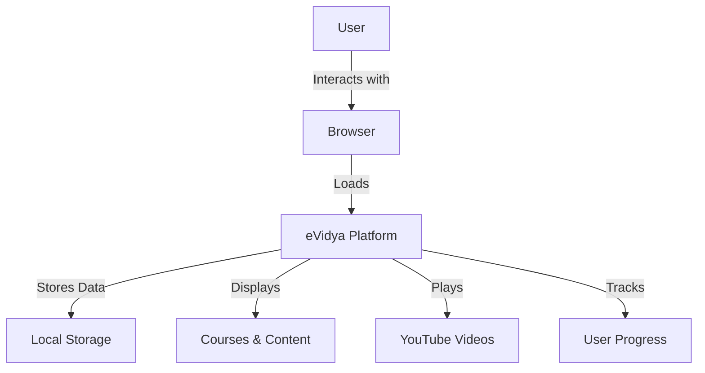
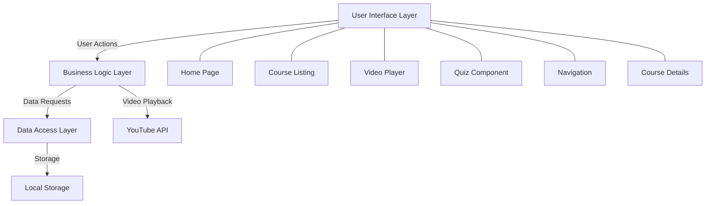
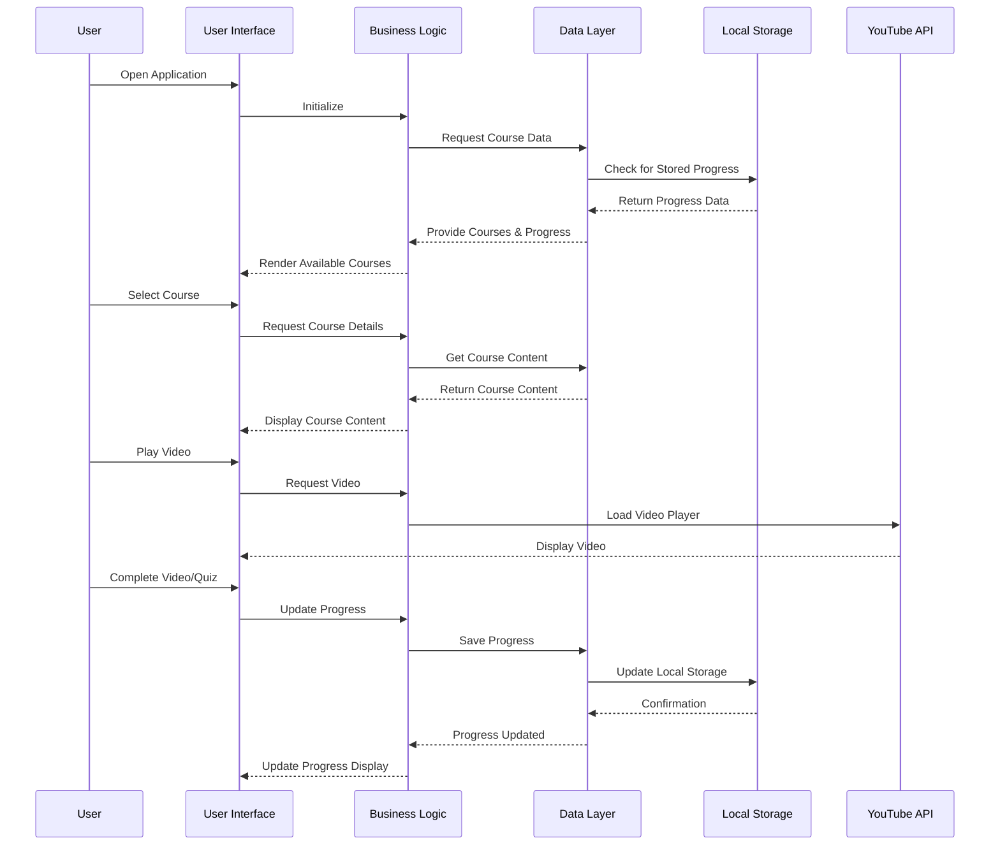
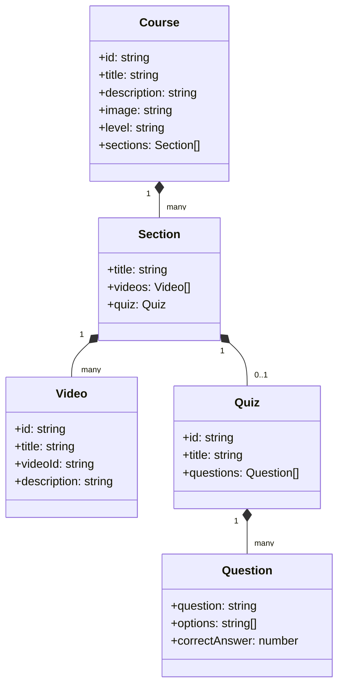
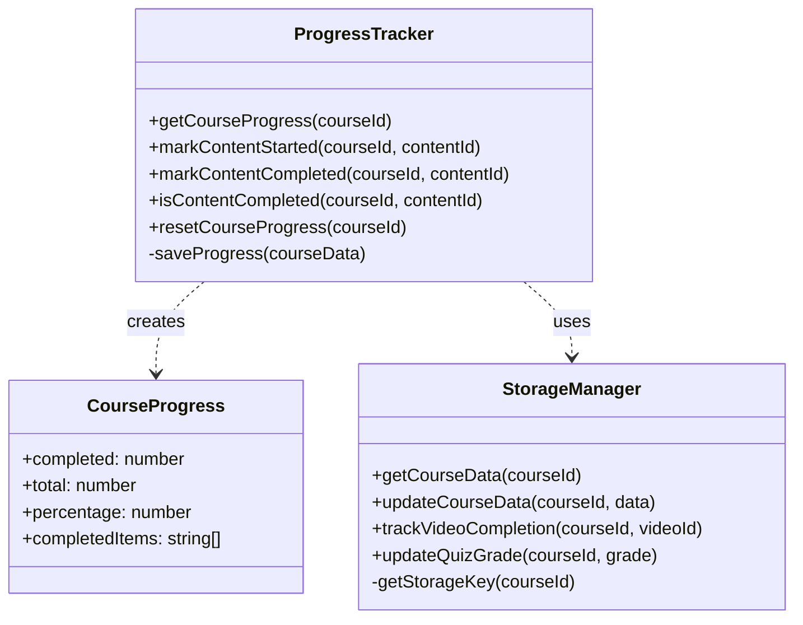
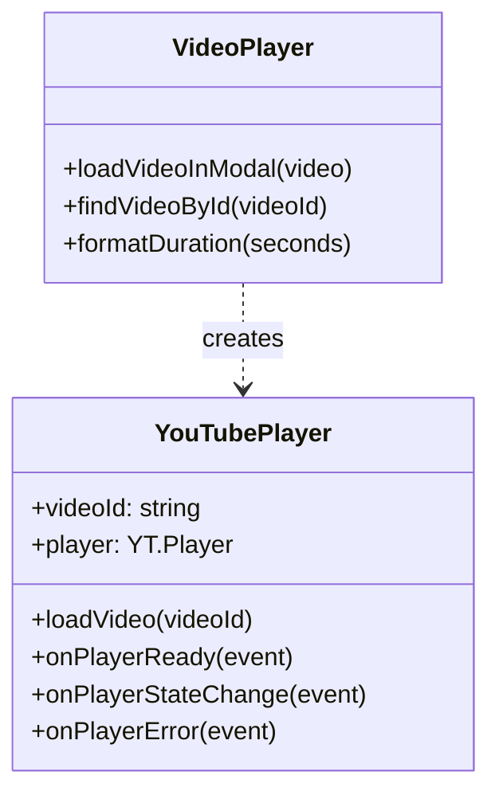
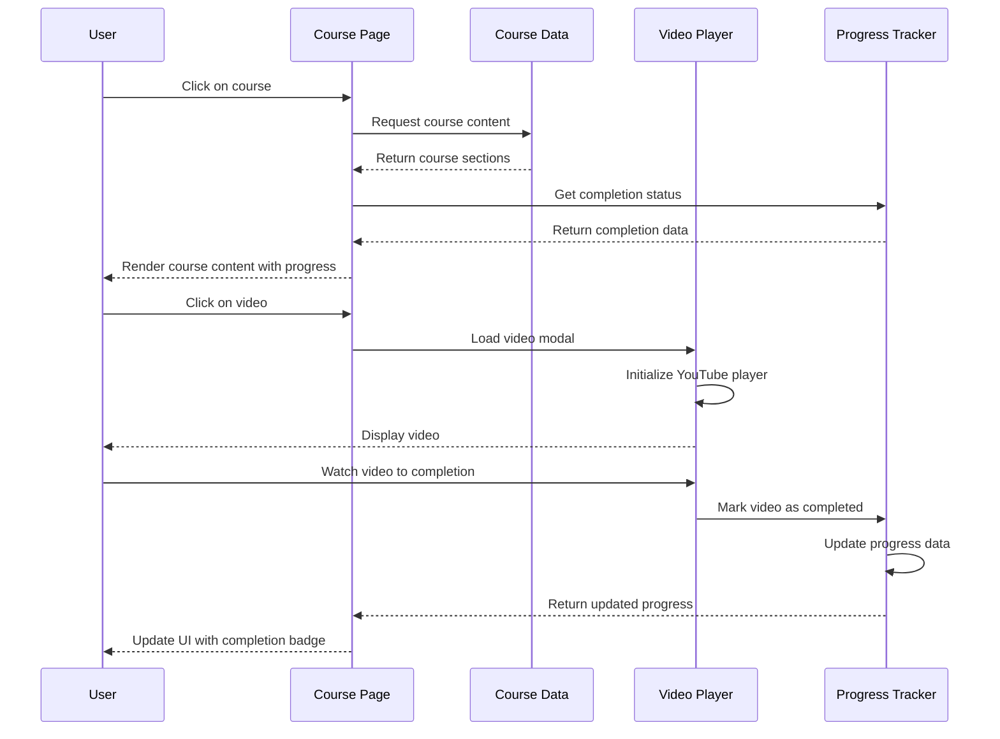
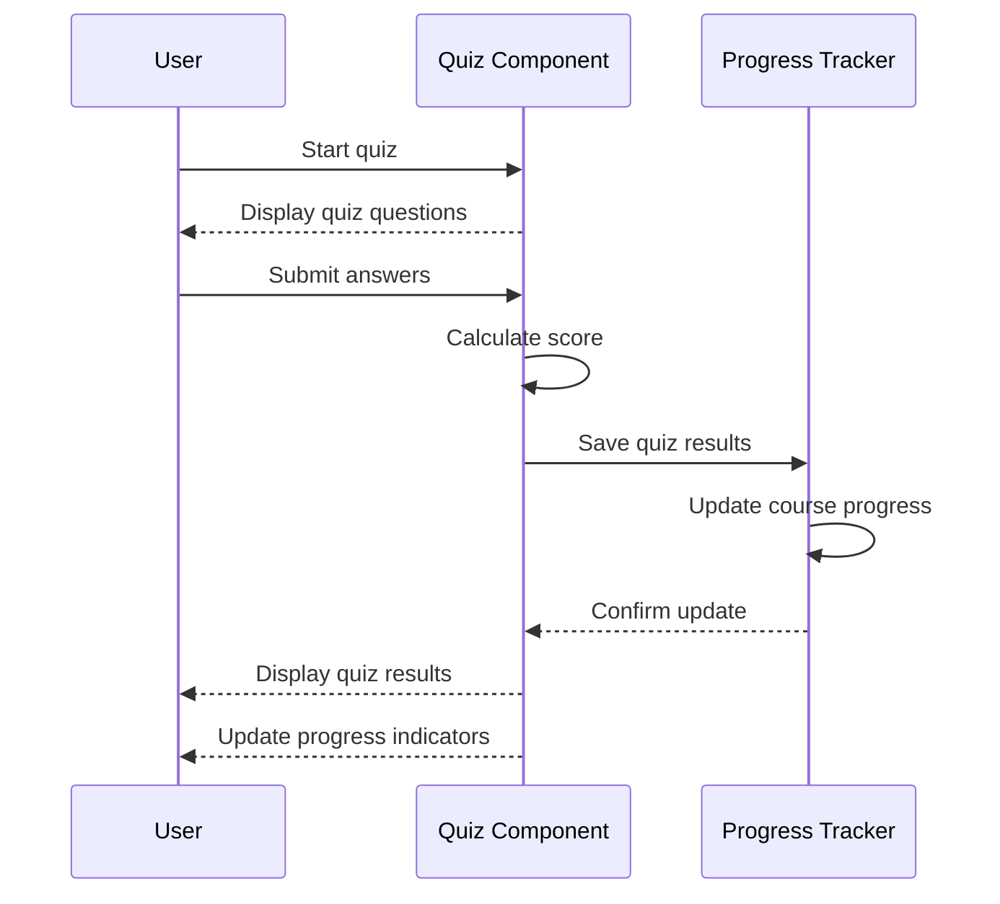
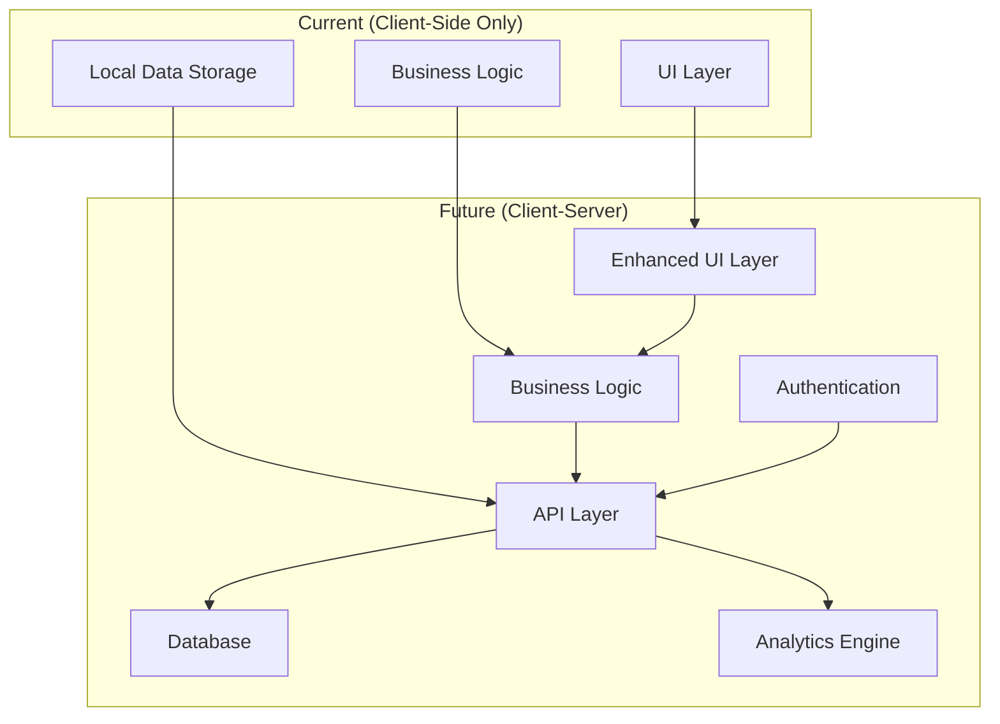

# eVidya Platform Architecture

This document provides a comprehensive overview of the eVidya platform's architecture, components, and data flow.

## Table of Contents

- [eVidya Platform Architecture](#evidya-platform-architecture)
	- [Table of Contents](#table-of-contents)
	- [Overview](#overview)
	- [Component Architecture](#component-architecture)
	- [Data Flow](#data-flow)
	- [File Structure](#file-structure)
	- [Core Components](#core-components)
		- [1. Course Data Management](#1-course-data-management)
		- [2. Progress Tracking System](#2-progress-tracking-system)
		- [3. Video Playback Component](#3-video-playback-component)
	- [Sequence Diagrams](#sequence-diagrams)
		- [Course Navigation Flow](#course-navigation-flow)
		- [Quiz Completion Flow](#quiz-completion-flow)
	- [Future Architecture](#future-architecture)

## Overview

eVidya is a client-side web application for interactive tech learning with course content, progress tracking, and video-based education. The application is designed to run entirely in the browser using HTML, CSS, and JavaScript, with data stored locally in the user's browser.

## Component Architecture

The eVidya platform follows a component-based architecture with distinct modules handling specific functionality.

## Data Flow

The following diagram illustrates how data flows through the eVidya platform:

## File Structure

eVidya's codebase is organized for clarity and maintainability:

```mermaid
graph TD
    Root[Root Directory]
    CSS[css/]
    JS[js/]
    Pages[pages/]
    Data[data/]
    Images[images/]
    GH[.github/]

    Root --> CSS
    Root --> JS
    Root --> Pages
    Root --> Data
    Root --> Images
    Root --> GH

    CSS --> Style[style.css]
    CSS --> CourseCSS[courses.css]
    CSS --> DetailCSS[course-details.css]
    CSS --> PlaceholderCSS[placeholder-images.css]
    CSS --> EnhancedCSS[enhanced-buttons.css]

    JS --> Main[main.js]
    JS --> CourseData[course-data.js]
    JS --> Courses[courses.js]
    JS --> Navigation[course-navigation.js]
    JS --> Progress[progress-tracker.js]
    JS --> Storage[storage.js]
    JS --> Details[course-details.js]
    JS --> Home[home.js]

    Data --> DataJS[course-data.js]
    Data --> ProgressData[progress-data.js]

    Pages --> CoursesHTML[courses.html]
    Pages --> FunctionalHTML[course-details.html]

    GH --> Scripts[scripts/]
    GH --> Workflows[workflows/]

    Scripts --> UpdateDurations[update-video-durations.js]

    class Root,CSS,JS,Pages,Data,Images,GH folder
    class Main,CourseData,Courses,Navigation,Progress,Storage,Details,DataJS,ProgressData,UpdateDurations js-file
    class Style,CourseCSS,DetailCSS,PlaceholderCSS,EnhancedCSS css-file
    class CoursesHTML,FunctionalHTML html-file
```

## Core Components

### 1. Course Data Management

### 2. Progress Tracking System

### 3. Video Playback Component

## Sequence Diagrams

### Course Navigation Flow

### Quiz Completion Flow

## Future Architecture

The roadmap for eVidya includes plans to evolve the architecture as follows:

---

This architecture document provides a comprehensive understanding of the eVidya platform's structure, components, and data flows. It serves as a guide for developers working on maintaining or extending the platform.
